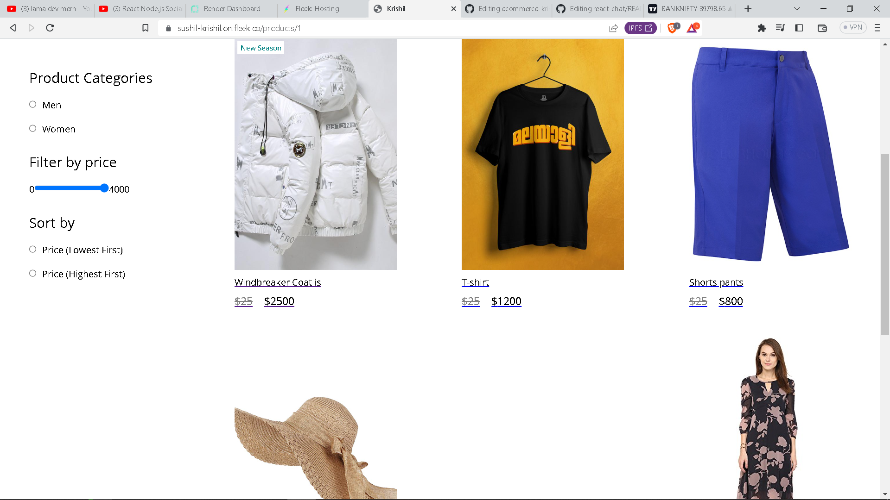
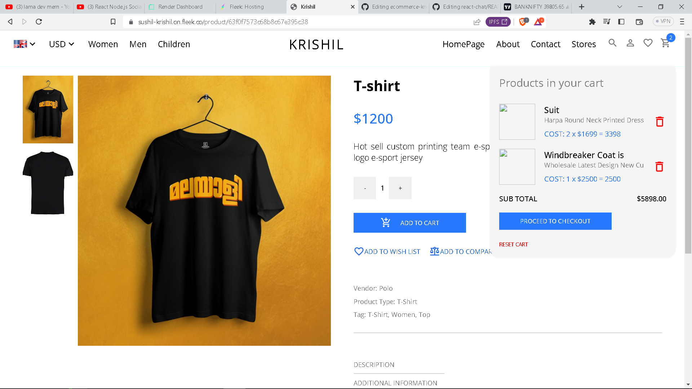

# MERN Stack E-commerce with MongoDB, Express.js, Redux, React, Node.js, Express.js, SASS, and Material UI

#### https://sushil-krishil.on.fleek.co

### Features:

-  State Management using Redux
-  filter product
-  Stripe checkout

#### Upcoming Features

- User Registration and Login
- Search features
- Favorite products
  





### Prerequisites

**Node version 14.x**

### Cloning the repository

```shell
git clone https://github.com/iprime2/ecommerce-krishil
```

### Setup .env file

```
REACT_APP_API_TOKEN = 
REACT_APP_API_URL = https://ecommerce-krishil.onrender.com/api
REACT_APP_UPLOAD_URL = http://localhost:1337
REACT_APP_STRIPE_KEY=
```

### Install packages

```shell
yarn 
```

### Start the app

```shell
yarn run start
```

## Available commands

Running commands with yarn `yarn run [command]`

| command         | description                              |
| :-------------- | :--------------------------------------- |
| `build`         | Build the webapp                         |
